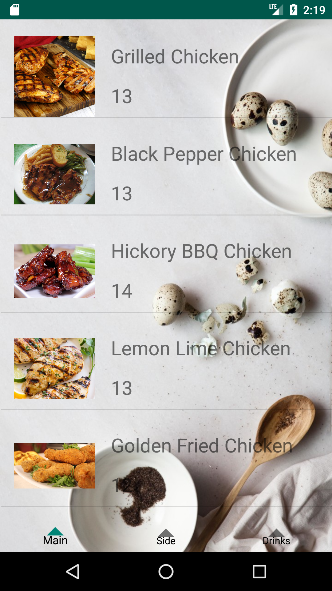
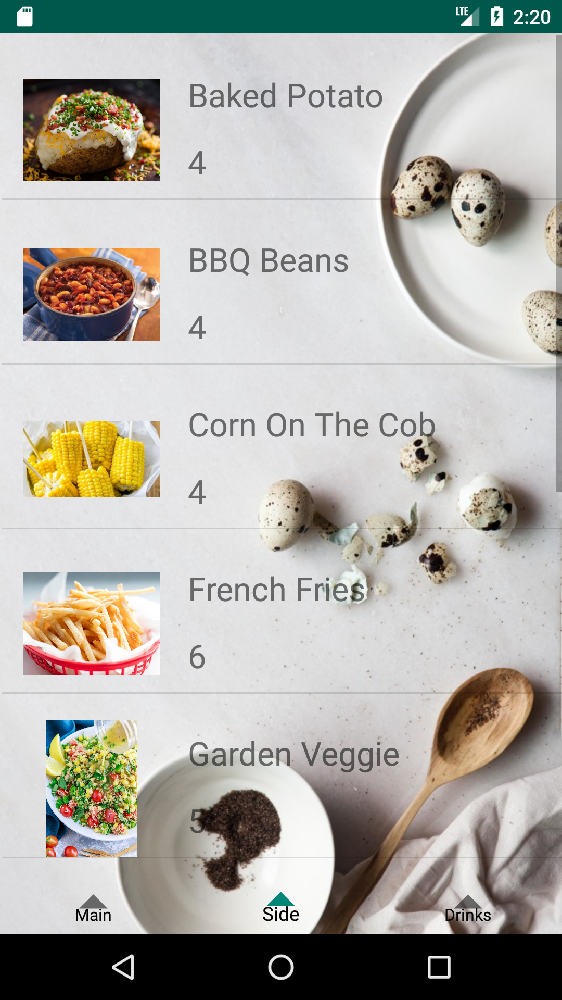
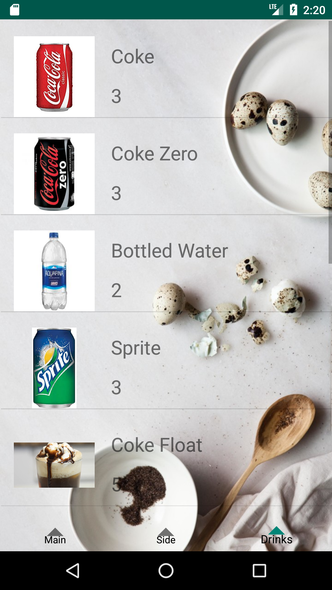
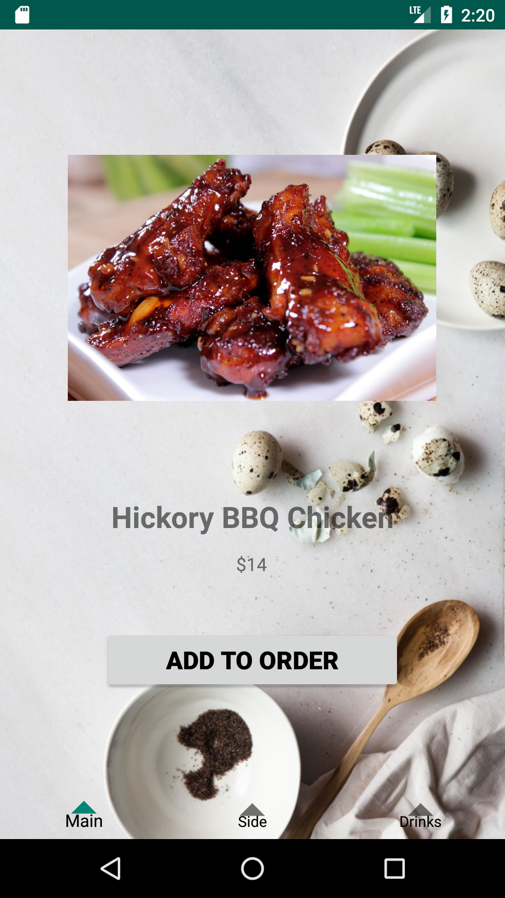
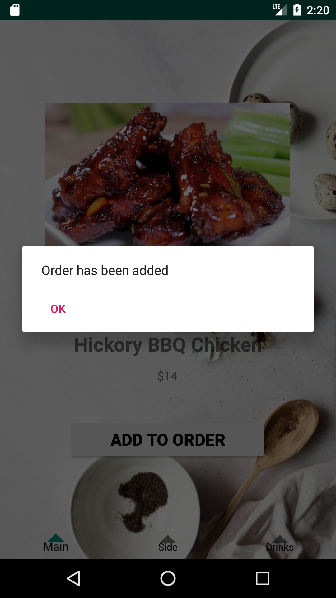
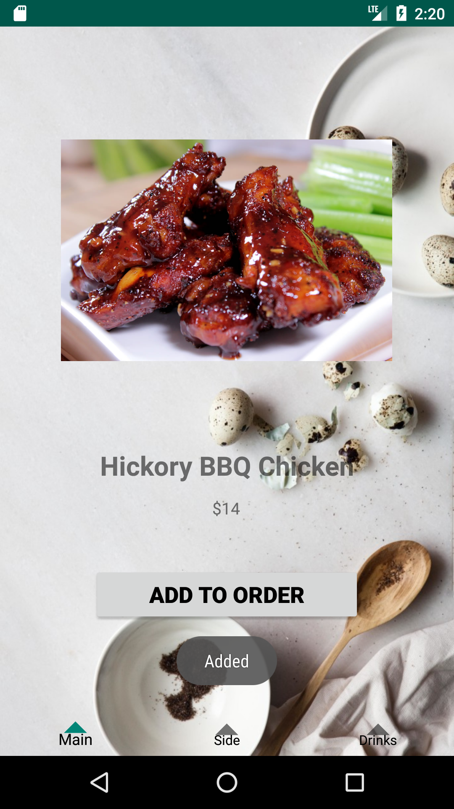

# orderget1updated

Team Members:  
Tan Kwang Wei S10186878B  
Shawn  
Ainsley S10186606A

The app is a E-Menu that allows users at the restaurant, Jiak, to use it. Instead of the traditional menu that most restaurant uses, this app allows user to view the menu of the restaurant and order food that they like directly to the restaurant system, allowing users to save time and make it more convenient. Once the customers has entered the restaurant, they can make use of the phone on the table to log in with the credentials that they have they previously created when coming to the restaurant. If it is the customer's first time at the restaurant, they can create an account too. Once they have logged in, they will be able to choose from the wide range of items in the menu. Once they have found their preferred item, they can select it and add it to order. The system will be notified of the selected item and will start preparing it and the user will receive a confirmation. The user can continue browsing for items and adding any items to order at any point of time.

Kwang Wei - Layouts, Fragments, ListViews  
Shawn - Log in / Sign up  
Ainsley - Images

Log In Screen 

Sign Up Screen 

Home Screen 

Main Menu 

Side Menu 

Drink Menu 

Selected Item Screen 

Add To Order Screen 

Confirmation Screen 

